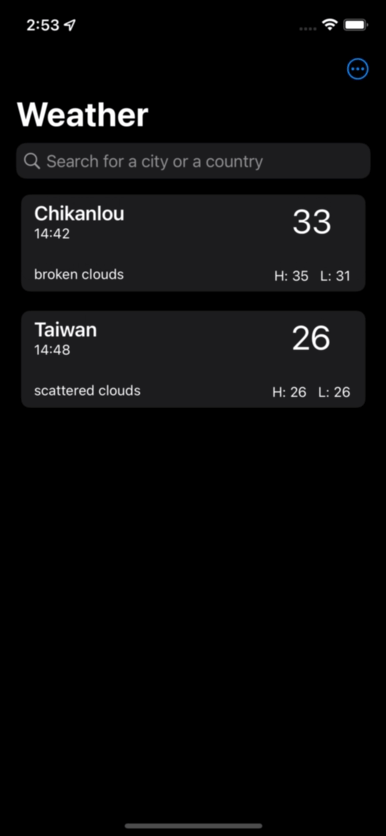

# weather
hello, I'm Roger, an IOS Developer
This project is practicing to make an IOS native weather app.
I get the weather api data from https://openweathermap.org/current
And all country api data from https://countriesnow.space/api/v0.1/countries

## Environment
* Xcode 13.3 +
* Snapkit package

## Features structure
* MVC structure
* CoreLocation used
* signleton
* PageViewControl

## Demo

